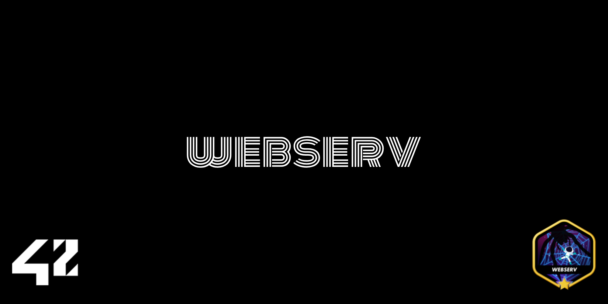

# Webserv



Welcome to **Webserv**, our journey into building an HTTP server from scratch using C++98. As a team of 2, we delved deep into network programming, protocol implementation, and non-blocking I/O—transforming theoretical knowledge into a fully functional web server. This project pushed us to understand what happens behind the scenes when you type a URL and press Enter, revealing the intricate dance between clients and servers that powers the modern web.

---

## What We Learned

Building **Webserv** transformed our understanding of web technologies and network programming:

- **The HTTP Protocol Beyond Theory:** We discovered that HTTP is elegant in specification but complex in implementation. Each header, status code, and method has nuances that only become apparent when you build the parsing logic yourself.

- **Non-blocking I/O is an Art Form:** We learned that truly non-blocking servers require careful orchestration. Using poll() to monitor multiple connections simultaneously taught us to think about I/O operations as state machines rather than sequential processes.

- **Socket Programming Intricacies:** Creating, binding, and managing sockets gave us deep insights into the TCP/IP stack. We now understand why connections can linger, how buffers fill and empty, and when connections truly terminate.

- **Configuration Parsing Challenges:** Building a NGINX-inspired configuration parser taught us about creating flexible, user-friendly interfaces for controlling complex systems without code changes.

- **Error Handling at Scale:** We discovered that robust error handling is what separates a toy project from a reliable server. Every file descriptor, memory allocation, and client connection needed thoughtful error management.

---

## Technical Discoveries

Our implementation journey revealed several key insights:

### The Beauty of Multiplexing

We implemented our server using poll() to handle multiple clients simultaneously. This taught us:

- How to design systems that respond to events rather than waiting sequentially
- Why modern servers can handle thousands of connections with limited threads
- How to avoid blocking operations that would freeze the entire server
- The importance of careful file descriptor management to prevent resource leaks

### HTTP's Hidden Complexities

Implementing the HTTP protocol revealed nuances we hadn't anticipated:

- Chunked transfer encoding requires careful buffer management
- Keep-alive connections blur the boundaries between requests
- Content-Length validation is crucial for security and stability
- Headers can arrive fragmented across multiple TCP packets
- URL parsing has numerous edge cases affecting routing decisions

### The CGI Dance

Implementing CGI support was particularly educational:

- We learned how web servers communicate with external programs through environment variables and pipes
- The importance of proper subprocess management to prevent zombie processes
- How to convert HTTP headers into environment variables for CGI scripts
- Why timing out CGI processes is essential for server stability

---

## Implementation Revelations

Our development process yielded several "aha!" moments:

- **Request Parsing State Machine:** We built a state machine to parse HTTP requests incrementally as data arrives, teaching us how servers handle partial data without blocking.

- **Buffer Management:** We learned that efficient memory usage requires careful buffer management—allocating too much wastes resources, too little causes fragmentation.

- **Config File Flexibility:** Building a configuration system taught us about separation of concerns and how to make software adaptable without recompilation.

- **Signal Handling:** We discovered the importance of graceful shutdown procedures and how to handle signals properly in a networked application.

- **Debugging Network Applications:** We developed strategies for debugging asynchronous operations, including logging systems that helped visualize the flow of data through our server.

---

## Technical Challenges Overcome

Some of the most valuable learning came from overcoming specific challenges:

### Maintaining Non-blocking Behavior

Ensuring our server remained non-blocking required vigilance:

- We had to carefully audit every system call to ensure it wouldn't block
- Learning to use fcntl to set non-blocking flags on file descriptors
- Designing a state machine that could pause and resume request processing
- Balancing between reading too little (inefficient) and too much (memory-intensive)

### Handling File Uploads

Implementing file uploads taught us about:

- Multipart form data parsing complexities
- Streaming data to disk rather than loading entire files into memory
- Validating uploads for security and resource management
- Progress tracking and timeout handling for large uploads

### CGI Implementation

Our CGI support required understanding:

- Proper environment variable setup for CGI compliance
- Bidirectional communication with subprocess through pipes
- Process management to handle CGI scripts that crash or hang
- Converting between chunked encoding and EOF-based communication

---

## Practical Skills Developed

Beyond theoretical knowledge, we developed practical skills:

- **Debugging Network Applications:** We learned techniques for tracing network flows, analyzing headers, and diagnosing connection issues.

- **Performance Profiling:** We discovered methods to identify bottlenecks in our server under load and optimize critical paths.

- **Test-Driven Development:** Creating test suites for HTTP parsing and response generation improved our code quality and confidence.

- **Collaborative Code Organization:** Working as a team on a complex system forced us to develop clear interfaces between components and maintain consistent coding standards.

---

## Getting Started

1. **Clone the Repository:**
   ```bash
   git clone https://github.com/korberlin/webserv.git
   cd webserv
   ```

2. **Build the Project:**
   ```bash
   make
   ```

3. **Run Webserv:**
   ```bash
   ./webserv [configuration_file]
   ```

4. **Test with a Browser:**
   Open your browser and navigate to `http://localhost:PORT` (where PORT is the port specified in your configuration).

---

## Personal Reflections

This project transformed our understanding of web technologies. Before **Webserv**, we knew HTTP superficially—after implementing every aspect ourselves, we now appreciate the elegance and complexity that makes the web possible.

We can now confidently say we understand why URLs start with HTTP, and what happens behind the scenes when you request a web page. The project name is truly fitting!


---

**Thank you for exploring our Webserv journey! 🌐**  
We hope our implementation and lessons learned provide insight into the fascinating world of HTTP servers and network programming, showing how theory transforms into functional, resilient code.